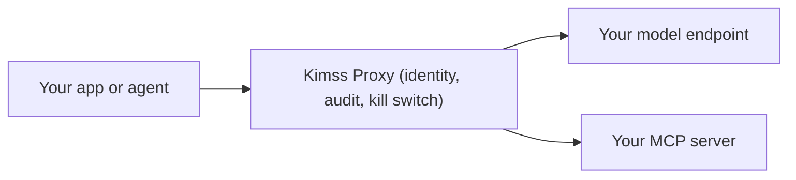

# Kimss Python SDK & MCP server

[](https://pypi.org/project/kimss/)
[](https://pypi.org/project/kimss/)
[](LICENSE)
[](https://github.com/eyal81/kimss-python-sdk/actions/workflows/ci.yml)

Your AI traffic is probably unmanaged: provider keys hardcoded in `.env` files, scripts calling models directly, no record of who made which call and no way to stop the next one. That is **Shadow AI**.

[Kimss](https://kimss.ai) is a **Secure AI Gateway** and **Governance Control Plane** that sits in front of the model endpoints you already own. This SDK is the integration layer: it routes your Python calls through the Kimss gateway (`X-Kimss-Key`), where every request gets identity, a governed audit trail, and a kill switch. Kimss never hosts your models and never charges for inference compute.

**30-second drop-in** (no Kimss SDK required):

```python
from openai import OpenAI
client = OpenAI(api_key="kimss_...", base_url="https://api.kimss.ai/v1")
```

Or zero-code:

```bash
OPENAI_BASE_URL="https://api.kimss.ai/v1"
OPENAI_API_KEY="kimss_..."
```

**Developer tier (Always Free):** 25,000 governed requests/month, 14-day telemetry, 5 builder & admin seats. No credit card. [Get a key](https://kimss.ai/app/signup).

| Inbound (your app → Kimss) | Vaulted BYO (Kimss → your provider) |
|----------------------------|-------------------------------------|
| OpenAI Python/JS/Java clients at `https://api.kimss.ai/v1` | OpenAI, Azure AI Foundry / Azure OpenAI, Anthropic Messages, DeepSeek, custom vLLM |
| Native `KimssClient` at `https://api.kimss.ai` | Internal MCP servers (Control Plane registration) |

Official Anthropic and Azure OpenAI SDKs are **not** inbound drop-ins. Vault those providers, then call `/v1` or this SDK.

**New here?** [GETTING_STARTED.md](GETTING_STARTED.md) · 5-minute tutorial: [eyal81/kimss-python-quickstart](https://github.com/eyal81/kimss-python-quickstart).

**AI assistants:** [docs/KIMSS_ONBOARDING.md](docs/KIMSS_ONBOARDING.md), [docs/llm-context.md](docs/llm-context.md), [CLAUDE.md](CLAUDE.md).



Includes an optional **Model Context Protocol (MCP)** server for **Cursor**, **Windsurf**, **Claude Desktop**, and other MCP-capable clients.

**AI assistants (dense HTTP map):** [.llms.txt](.llms.txt).

## Cursor Marketplace plugin

This repository includes a **Cursor plugin** layout for [Cursor Marketplace](https://cursor.com/marketplace/publish) submission alongside the PyPI package:

| Path | Purpose |
|------|---------|
| [`.cursor-plugin/plugin.json`](.cursor-plugin/plugin.json) | Plugin manifest (`name`, `version`, `author`, `logo`, …) |
| [`mcp.json`](mcp.json) | MCP server template (`uvx` → `kimss-mcp-server`) |
| [`rules/kimss-product.mdc`](rules/kimss-product.mdc) | Product and API conventions for assistants |
| [`skills/kimss-sdk/SKILL.md`](skills/kimss-sdk/SKILL.md) | Python SDK integration skill |
| [`skills/kimss-mcp-setup/SKILL.md`](skills/kimss-mcp-setup/SKILL.md) | MCP wiring and troubleshooting skill |
| [`commands/`](commands/) | Slash commands: `kimss-setup`, `kimss-create-agent`, `kimss-diagnose` |
| [`assets/logo.svg`](assets/logo.svg) | **1:1** marketplace logo (Kimss wordmark on a plate, from product art); [`assets/logo.png`](assets/logo.png) is a **512×512** PNG fallback (regenerate from the SVG in your design pipeline if you need a pixel-perfect raster) |

Legacy Open Plugins metadata remains under [`.plugin/plugin.json`](.plugin/plugin.json) and [`mcpb/manifest.json`](mcpb/manifest.json). The root [`.mcp.json`](.mcp.json) matches `mcp.json` for environments that read dot-prefixed MCP config.

## Cursor & Windsurf (MCP) — zero local venv with `uvx`

Install the MCP extra on the fly and expose tools to your IDE:

```json
{
  "mcpServers": {
    "kimss": {
      "command": "uvx",
      "args": ["--from", "kimss[mcp]", "kimss-mcp-server"],
      "env": {
        "KIMSS_API_KEY": "your_key_here",
        "KIMSS_BASE_URL": "https://api.kimss.ai",
        "KIMSS_WORKSPACE_ID": ""
      }
    }
  }
}
```

- Set `KIMSS_API_KEY` to a long-lived key from **Developer Settings → API Keys** (never commit it).
- Optional `KIMSS_WORKSPACE_ID` stamps `X-Workspace-ID` / `tenant_id` for workspace-scoped calls.
- MCP tools are **non-streaming** in v1 (`kimss_chat`, `kimss_create_agent`, `kimss_run_agent`, `kimss_complete`, `kimss_upload_file`, `kimss_add_function_to_agent`).

Alternatively, after `pip install 'kimss[mcp]'`, use `"command": "kimss-mcp-server"` on your PATH with the same `env`.

## Windsurf Integration

To use Kimss natively inside Codeium Windsurf as an MCP toolset, add the configuration to your local Windsurf settings:

1. Open your global Windsurf MCP configuration file:
   - **macOS/Linux:** `~/.codeium/windsurf/mcp_config.json`
   - **Windows:** `%USERPROFILE%\.codeium\windsurf\mcp_config.json`

2. Append the `kimss` config block to the `mcpServers` object:

```json
{
  "mcpServers": {
    "kimss": {
      "command": "uvx",
      "args": ["--from", "kimss[mcp]", "kimss-mcp-server"],
      "env": {
        "KIMSS_API_KEY": "your_api_key_here",
        "KIMSS_BASE_URL": "https://api.kimss.ai"
      }
    }
  }
}
```

3. Reload Windsurf. The `kimss` tools appear under the MCP toolset once the server starts.

> Note: use `uvx --from kimss[mcp] kimss-mcp-server` (not `--with`). `--from` tells `uvx` to install the `kimss` package and run its `kimss-mcp-server` console script; `--with` would make `uvx` look for a (nonexistent) PyPI package literally named `kimss-mcp-server`.

## Claude Desktop Integration

Connect Kimss agents as MCP tools inside [Claude Desktop](https://claude.ai/download):

1. Install [`uv`](https://docs.astral.sh/uv/) so `uvx` is on your `PATH` (or use `pip install 'kimss[mcp]'` and set `"command": "kimss-mcp-server"` instead).
2. Create a long-lived API key in the Kimss app: **Developer Settings → API Keys**.
3. Open the MCP config: **Claude Desktop → Settings → Developer → Edit Config** (preferred — opens the correct `claude_desktop_config.json` for your install). Typical paths if you edit by hand:
   - **macOS:** `~/Library/Application Support/Claude/claude_desktop_config.json`
   - **Windows (classic installer):** `%APPDATA%\Claude\claude_desktop_config.json`
   - **Linux:** `~/.config/Claude/claude_desktop_config.json`
4. Merge the `kimss` block into `mcpServers` (keep any existing servers):

```json
{
  "mcpServers": {
    "kimss": {
      "command": "uvx",
      "args": ["--from", "kimss[mcp]", "kimss-mcp-server"],
      "env": {
        "KIMSS_API_KEY": "your_api_key_here",
        "KIMSS_BASE_URL": "https://api.kimss.ai",
        "KIMSS_WORKSPACE_ID": ""
      }
    }
  }
}
```

5. Fully quit and relaunch Claude Desktop. Confirm Kimss tools appear (hammer / MCP tools indicator in the chat composer).

**Try it:** ask Claude to list or run a Kimss agent (you need an `asst_…` id from the Kimss app), for example: *“Use kimss_run_agent with my assistant id asst_xxxx and message Hello.”*

> Tip: On Windows Store / MSIX installs the config file can live under `%LOCALAPPDATA%\Packages\Claude_*\…` instead of `%APPDATA%\Claude\`. Always prefer **Settings → Developer → Edit Config** so you edit the file Claude actually reads.

Legacy Desktop Extension metadata for MCP bundles lives under [`mcpb/manifest.json`](mcpb/manifest.json) (same `uvx --from kimss[mcp] kimss-mcp-server` entrypoint).

## Install (library)

```bash
pip install kimss
```

> **To route traffic, you must create a free control plane namespace. [Get your API key at kimss.ai](https://kimss.ai/app/signup) (25,000 governed requests/mo included. No credit card).**
>
> The Developer tier is always free — 25,000 governed requests/month, 14-day telemetry retention, no expiration cliff.

Optional **PII redaction** (Microsoft Presidio + spaCy; e.g. `python -m spacy download en_core_web_lg`):

```bash
pip install 'kimss[privacy]'
```

Other extras:

```bash
pip install 'kimss[mcp]'   # MCP server (stdio)
pip install 'kimss[types]' # Pydantic (reserved for future typed models)
pip install 'kimss[dev]'    # pytest, responses, ruff
```

Editable from a checkout of this repository root:

```bash
pip install -e ".[dev,mcp]"
```

## Authentication

Use a **long-lived API key** (not a browser session token). Create keys in your Kimss app under **Developer Settings → API Keys**. The key is scoped to your tenant and user.

Headless workers can also authenticate with Microsoft Entra ID by passing
an Azure credential plus a Kimss API token scope:

```python
from azure.identity import DefaultAzureCredential
from kimss import KimssClient

client = KimssClient(
    base_url="https://api.kimss.ai",
    credential=DefaultAzureCredential(),
    token_scope="api://<kimss-api-app-id>/.default",
    workspace_id="<your-workspace-slug>",
)
```

## Usage

Use the canonical Kimss API host. Production is `https://api.kimss.ai` and staging is `https://stg.kimss.ai`; do not include a trailing slash.

```python
from kimss import KimssClient, Agent

client = KimssClient(
    api_key="kimss_xxxxxxxxxxxxxxxxxxxxxxxx",  # from Developer Settings
    base_url="https://api.kimss.ai",  # no trailing slash
)

# Get an agent and send a message
agent = client.get_agent("asst_xxxx")
result = agent.query("Hello")
# result is the API "res" payload (messages, usage, etc.). Prefer conversation_id in SDK 2+.
result2 = agent.query("What did I just say?", conversation_id=result.get("thread_id"))

# Preferred: Agent.handle via agents.get → POST /v1/agents/run
result_v1 = client.agents.get("asst_xxxx").run("Hello", stream=False)
print(result_v1.text, result_v1.usage.total_credits, result_v1.conversation_id)
```

### Streaming

`client.models.create(..., stream=True)` and `client.agents.run(..., stream=True)` return an **SSE iterator** of JSON objects. The MCP server does not expose streaming tools in v1.

## API

- **`KimssClient(..., retry=None)`** – authenticated client. Provide either `api_key` (uses `X-Kimss-Key`) or `credential` + `token_scope` (uses `Authorization: Bearer`). `workspace_id` optionally stamps `X-Workspace-ID` and `tenant_id` for isolated worker telemetry. Uses a `requests.Session` with **retry on 5xx** (not 429) and **Retry-After** by default so allowance exhaustion and rate limits surface immediately as typed errors (`KimssGovernedRequestsExhausted` for the monthly governed-request cap, `KimssCreditExhausted`, `KimssRateLimited`, `KimssSubscriptionRequired`).
- **`client.get_agent(agent_id)`** / **`client.agents.get(agent_id)`** – returns an `Agent`. **`Agent.run`** calls `POST /v1/agents/run`.
- **`agent.query(message, conversation_id=None, chat_type="user_chat")`** – send a message via `POST /v1/agents/run` (same as **`Agent.run`**).
- **`client.chat(assistant_id, message, conversation_id=None, chat_type="user_chat")`** – one-off chat without an Agent handle.
- **`client.agents.create` / `client.agents.run`** – v1 agent management and orchestration (`/v1/agents/create`, `/v1/agents/run`). **`agents.run`** accepts positionals `(assistant_id, message)`, keyword aliases **`agent_id` / `prompt`**, optional **`conversation_id`** (maps to JSON `thread_id`), optional **`tags`** and **`routing_preference`**; **`stream=False`** returns **`AgentRunResult`** (dict subclass with **`.text`**, **`.usage.total_credits`**, **`.conversation_id`**) when `res` is a dict.
- **`client.models.create`** – `/v1/models/completions` (Kimss `{"res": ...}` envelope).
- **OpenAI-compatible HTTP** (not wrapped by this client): `GET /v1/models`, `POST /v1/chat/completions` at `base_url` + `/v1` with `Authorization: Bearer kimss_...` — for OmniRoute, Cursor, Cline, or `openai.OpenAI(base_url="https://api.kimss.ai/v1", ...)`.
- **`client.files.upload`** – `/v1/files/upload` (ephemeral completion attachments; Kimss does not host RAG).
- **`before_request_hooks`** – list of callables `hook(ctx)` where `ctx` is `{"path": str, "json": dict, "headers": dict}`; hooks may mutate `json` / `headers` before the HTTP POST.
- **`privacy`** – shortcut for `PresidioRedactor()` from `kimss.privacy` (requires `kimss[privacy]`).

```python
from kimss import KimssClient, PresidioRedactor

client = KimssClient(
    api_key="kimss_...",
    base_url="https://api.kimss.ai",
    privacy=PresidioRedactor(),
)
```

API-key requests use the `X-Kimss-Key` header. Credential requests use
`Authorization: Bearer <token>`. Non-streaming responses are full JSON dicts from the API `res` envelope where applicable.

## Examples

See [examples/](examples/) — set `KIMSS_API_KEY` (and `KIMSS_ASSISTANT_ID` / `KIMSS_MODEL` where noted). For the guided route-your-first-governed-call walkthrough, use [eyal81/kimss-python-quickstart](https://github.com/eyal81/kimss-python-quickstart).

## Usage Hub (execution context)

For agent and model calls, the SDK automatically adds an optional **`X-Kimss-SDK-Context`** header (base64url JSON) with:

- **`host_environment`** — e.g. Azure `WEBSITE_SITE_NAME`, `GitHub:org/repo`, or `Local/Dev`
- **`source_location`** — best-effort path to the caller's Python file (relative to `getcwd()` when possible)
- **`resource_type`** / **`resource_name`** — `agent` or `model` plus assistant id or model id

Paths are resolved in your process and sent as metadata for the workspace **Usage** dashboard. Use `before_request_hooks` to remove that header from `ctx["headers"]` if your policy forbids file paths.

## Contributing & release

See [CONTRIBUTING.md](CONTRIBUTING.md) for tests, mirror workflow, and PyPI trusted publishing. **Operator bookmark (monorepo):** [3-step release routine](../plans/2026-05-26-kimss-sdk-release-routine.md).
